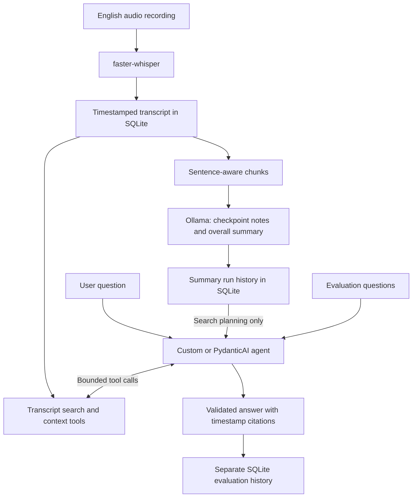

# Local Voice Agent

Turn English audio recordings into timestamped transcripts, AI-generated notes, and answers
you can check against the source.

A local Python CLI for making **lecture notes**, reviewing **meeting discussions**, and asking
follow-up questions about a recording. The AI reads the transcript to produce checkpoint notes,
important points, main topics, and an overall summary. Transcription uses faster-whisper;
notes and question answering use local models through Ollama.

**Status:** working CLI prototype with persistent history, three question-answering modes,
and a repeatable evaluation workflow.

## See it in action

**Recording → transcript → notes → follow-up question → timestamped answer**

Example from a stored evaluation of an English spoken article about poetry:

> **Question:** Why does the recording describe poetry as difficult to translate, and why might
> the Hebrew Psalms be an exception?
>
> **Answer:** Poetry is notoriously difficult to translate because it emphasizes linguistic form
> rather than using language purely for its content [00:01:20-00:01:32]. The Hebrew Psalms might be
> an exception because their beauty is found more in the balance of ideas than in the specific
> vocabulary [00:01:32-00:01:45].

This is the saved answer from the custom `final` workflow with qwen3.5:4b, rather than a
handwritten mock-up. The note-generation workflow is useful for reviewing lecture material or
meeting discussions; speaker identification and dedicated decision/action-item extraction
are not implemented in the current note output.

## Engineering work in this project

The project explores both implementing agent orchestration directly and integrating an agent
framework around the same application tools.

- **Audio and storage pipeline:** timestamped transcription, processing status, error history,
  and SQLite persistence.
- **Transcript-to-notes workflow:** split recordings into approximately ten-minute chunks near
  sentence boundaries, generate checkpoint notes, and combine them into an overall summary.
  Keep successful summary runs separately for later inspection.
- **Custom agent orchestration:** bounded tool execution, repair attempts, and a separate
  structured answer phase. The original fully manual loop remains a comparison baseline.
- **Evidence controls:** deterministic transcript search, selection of search-result segment
  IDs, and automatic ±30-second context retrieval. In `final` and `pydanticai` modes, claims
  may cite only inspected segments, and the application renders their timestamps.
- **PydanticAI integration:** use framework-managed function calls and output validation while
  retaining the application's search tools, evidence rules, storage, and evaluation.
- **Evaluation and debugging:** a versioned question set, model/mode matrix runs, immutable
  completed evaluation history, input fingerprints, partial failure telemetry, and offline tests.

Code entry points: [agents](src/local_voice_agent/agent.py),
[PydanticAI integration](src/local_voice_agent/pydantic_agent.py),
[notes](src/local_voice_agent/summaries/summarizer.py),
[retrieval](src/local_voice_agent/retrieval.py), and [evaluation](src/local_voice_agent/evaluation/).

## Architecture and design choices



**Local models** keep audio and transcript processing on the machine when using local Ollama
models and the default local endpoint. Initial model downloads require network access.
**SQLite** keeps storage inspectable without a separate database service.
**Lexical retrieval** provides a deterministic baseline before adding semantic search.
**Pydantic schemas** validate structure; application checks restrict source IDs.
Neither establishes that a claim's meaning is supported by the cited text.

## Custom orchestration vs PydanticAI

PydanticAI is an agent framework, not a finished transcript QA application. The comparison
changes orchestration while retaining the same transcript tools and evaluation dataset.

| Mode | How it works |
| --- | --- |
| `manual` | Custom loop chooses tools or an answer, with bounded validation and repairs. |
| `final` (default) | Custom retrieval loop followed by a tool-free, structured answer phase. |
| `pydanticai` | Framework-managed tool calls followed by a tool-free, structured answer phase. |

A first experiment used **12 questions on one recording**, including two questions the source
cannot answer. Five runs used the same transcript, dataset, summary context, and step limit.

| Mode | Model | Completed answers¹ | Mean seconds/question² |
| --- | --- | ---: | ---: |
| `final` | qwen3.5:4b | 12/12 | 97 |
| `manual` | qwen3.5:4b | 5/12 | 134 |
| `final` | qwen3.5:9b | 11/12 | 225 |
| `pydanticai` | qwen3.5:4b | 11/12 | 130 |
| `pydanticai` | qwen3.5:9b | 12/12 | 211 |

¹ Completion means an accepted output, **not a correct or complete answer**.
² Includes failed attempts; these are observations on the development machine, not hardware-normalized benchmarks.

An **AI-assisted review against the transcript** found PydanticAI + 9b strongest overall in
these runs. Custom `final` + 4b was fastest, while PydanticAI did not improve the 4b results.
Even the strongest run omitted a qualification and included an incomplete citation span.

The central finding: **valid output and high timestamp-overlap scores do not guarantee a
faithful answer**. This is one run per tested combination, not evidence that one framework
is generally better. [Read the methodology, examples, and limitations](docs/evaluation-results.md).

## Quick start

Install Python 3.12+ and Ollama, start Ollama, and run from the repository root in PowerShell:

```powershell
python -m venv .venv
.\.venv\Scripts\python.exe -m pip install -e .
ollama pull qwen3.5:4b
.\.venv\Scripts\python.exe -m local_voice_agent doctor
.\.venv\Scripts\python.exe -m local_voice_agent process "C:\path\to\lecture.mp3"
```

The default transcription model is `small.en`, running on CPU with `int8`; its first use
downloads model weights. Use the session ID printed by `process` in the next commands
(`1` is an example):

```powershell
.\.venv\Scripts\python.exe -m local_voice_agent summarize 1 --content-mode informational
.\.venv\Scripts\python.exe -m local_voice_agent notes --session-id 1
.\.venv\Scripts\python.exe -m local_voice_agent summary 1
.\.venv\Scripts\python.exe -m local_voice_agent ask 1 "What are the main ideas discussed?" --debug
```

To use the optional PydanticAI mode:

```powershell
.\.venv\Scripts\python.exe -m pip install -e ".[pydanticai]"
.\.venv\Scripts\python.exe -m local_voice_agent summarize 1 --summary-mode pydanticai
.\.venv\Scripts\python.exe -m local_voice_agent ask 1 "What are the main ideas discussed?" --agent-mode pydanticai
```

[Full usage guide](docs/usage.md): recording and note commands, configuration, agent limits,
evaluation matrices, answer inspection, and SQLite browsing.

Notes support `--summary-mode custom` (default) and `--summary-mode pydanticai`. Both share
chunking, prompts, schemas, and a one-repair limit per checkpoint/final output. PydanticAI
handles structured generation without retrieval tools. Each successful run records its mode;
`summary-runs`, `summary`, and `notes` display it. Note quality has not yet been compared
between these implementations; the experiment above concerns question answering only.

## Validation and next steps

Offline tests cover agent validation, evidence restrictions, failure handling, evaluation
history, and schema migration. Framework tests use scripted PydanticAI models and simulated
HTTP responses. Install the optional dependency to include them:

```powershell
.\.venv\Scripts\python.exe -m unittest discover -s tests -v
```

Current limits: English recordings, CLI interaction, single-session lexical search, and no
speaker diarization or real-time capture. Transcription errors can affect both notes and
answers. The initial QA evaluation does not establish note quality on lectures or meetings.

Next priorities are broader recordings and repeated evaluations, claim-level content and
citation checks, and a measured comparison of lexical and hybrid retrieval.
